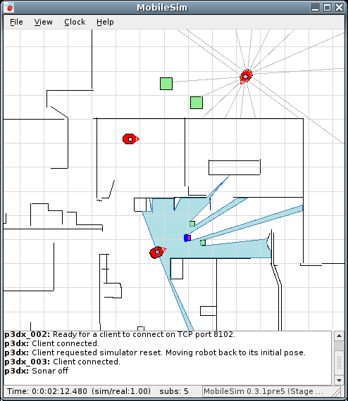
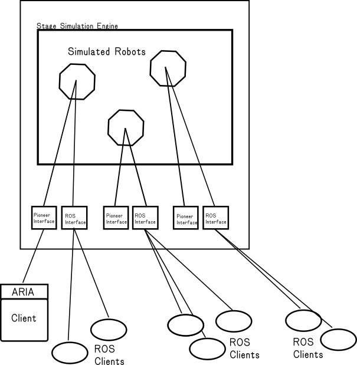

AMRISim Abstract 2-D Multi-Robot Multi-Interface Mobile Robot Simulator
=======================================================================

Introduction
------------

AMRISim is software for simulating multiple mobile robots with multiple
software interfaces, in a highly simplified, abstract, two-dimensional way,
for debugging and experimentation.

Current software interfaces available are Pioneer protocol
(for [ARIA](http://robots.mobilerobots.com/wiki/ARIA) or
[AriaCoda](http://github.com/reedhedges/AriaCoda)  and [ROS](http://ros.org) (under development, 
not included on Windows).

AMRISim can be built on Linux, Windows using MinGW (untested currently) and Mac OSX.

Many Pioneer-based robot model configurations and other
Pioneer-related features are included.
MobileRobots/ARIA map file format to define the environment
(walls) is currently supported. (A tool is provided to convert
a bitmap file to a map file.)

Other robot types and more general features may be added in the future.  Users may configure
their own robot models.

If you would like to discuss contributing additions and changes,
please use the [GitHub page](http://github.com/reedhedges/AMRISim)
or [contact me](mailto:reedhedges@gmail.com).  See [TODO.txt] for some
changes that should probably me made.

If you would like to hire me to add interfaces, features, or address
issues or bugs, please [contact me](mailto:reedhedges@gmail.com).

AMRISim normally runs as an interactive application with GUI.  A noninteractive
mode may be enabled in which messages are logged rather than displayed to the
user via the GUI.  Logging is configurable.    Various GUI options may be
disabled for performance.   A build variant of AMRISim may be added in
the future in which no GUI (GTK/X-Windows) dependences are included in the
build, as well, for complete background use on a server.

Please discuss requirements for additional robot model configuration
tools, and additional software interfaces, on the [GitHub project
page](http://github.com/reedhedges/AMRISim),
and see [TODO.txt](TODO.txt).

AMRISim is based on the Stage library, created by the [Player/Stage
project](http://playerstage.sourceforge.net)
and is a continuation of the open source "MobileSim" product formerly provided
by Omron Adept MobileRobots under the GNU General Public License.
Stage and AMRISim are free software, distributed under the terms of the GNU
General Public License:

See [the full license](LICENSE.txt) for details.

How it Works
------------

AMRISim (optionally) converts a MobileRobots/ActivMedia map (a .map file,
created by Mapper3;, Mapper3-Basic, or other means) to a Stage
environment, and places a simulated robot model in that
environment.

AMRISim then creates a Pioneer control interface and a ROS 
interface for each simulated robot (unless disabled).

*Note*: it is possible for multiple ROS clients to connect
to the ROS interface, and for one client program to connect
to the Pioneer interface (using the ARIA library).  However,
it is not generally possible for any ROS clients to control
a robot through the ROS interface while a Pioneer client
is connected as well, since conflicting motion commands
will be received through both interfaces.  Multiple ROS clients
sending continuous or frequent motion commands will also
conflict.  It is recommended that you use either the
Pioneer interface or the ROS interface at any one time.
It is also recommended that you design your ROS application
such that only one ROS client is sending motion commands
(`cmd_vel`) or they are carefully coordinated.   (ROS clients
can generally recieve published data while a Pioneer client
is connected, however, for logging, data collection, visualization,
offline work, etc.) 

The Pioneer interface is an emulated Pioneer robot but with a
connection accessible via a TCP port (similar to the real
Pioneer's serial port connection).  ARIA/AriaCoda is able to connect
to TCP ports instead of serial ports (ArRobotConnector, for example,
automatically tries TCP port 8101 before the serial port).

See below for description of which parts of the Pioneer protocol
are implemented, and simulator-specific extensions.

The host running AMRISim is advertised via a simple 
broadcast discovery protocol, compatible with the Lantronix WiBox
device used on some Pioneer robots.  (MDNS-SD or another service 
discover protocol can perhaps be added if desired, contact the maintainer(s)).  
(Aria and AriaCoda include a feature in their Python interfaces to 
discover available AMRISim hosts or WiBox devices via a short network
broadcast.) For details on this protocol see below. 

The ROS interfaces are in-process nodes created for each simulated
robot.  If no ROS master is detected, an option is 
presented to start roscore. The nodes currently have 
arbitrary names beginning with the prefix "AMRISim-"
(but better naming may be added in the fututre, similar to how
information about robots is logged and reported via Pioneer connection.)
See below for ROS topics.

`

Features
--------

AMRISim (powered by Stage) has the following features
and device models. Device model parameters may be customized in a
configuration file, or new models may be defined based on existing
models.

* Various models of MobileRobots/ActivMedia differential drive
    mobile robot bases (Pioneer 3 DX and AT, PowerBot&trade;, AmigoBot&trade;,
    PeopleBot&trade;, PatrolBot&reg;, Seekur&reg;, Pioneer 2, Pioneer 1).
* You can define custom models of differential drive or
    omnidirectional robots, laser and sonar, defined either as
    a Stage model definition (stored in a configuration file), 
    or by loading an Aria parameter (.p) file.
* Sonar range sensor model, with customizable properties
* Laser range sensor model, with customizable properties
* Robot odometry pose estimation (with cumulative error)
* Simple GPS model (latitude and longitude calculated based
  on map georeference)
* Multiple robots (good performance is possible on a fast computer with
  more than 50 robots)
* Evironment and obstacles are loaded from a
  MobileRobots/ActivMedia/ARIA map file; use the same map with ARNL/SONARNL or
  your own software.
* Interactively move robots and obstacles
* Objects (robots or obstactles) may be configured to be detectable
    only by some sensors
* Objects (robots or obstacles) may be set as "highly reflective"
    for special detection by the laser range sensor
* Save image "snapshot" of simulation or save a sequence of images
    for making movies.
* Map files may be reloaded at run time
* Robots may be interactively repositioned through the GUI or by
    a command from client software
* Simulation information (such as time, robot true absolute positions, etc.
  is available to clients and displayed in UI.
* Client software may send log messages to AMRISim. Log messages
    are timestamped and displayed both the GUI and console or log file, with
    optional HTML formatting.
* Visualization options for sensors, robots and obstacles, such as
    drawing robot "trails" to show history of motion, color, diagnostic
    values/visualization, and visualizations for debugging the simulator
    itself.
* Configurable space and time resolutions.
* Full source code included under the GPL for understanding
    the simulation implementation, customizing and improving it,
    or even adapting AMRISim's ARIA communication protocol layer for
    other simulators.
* And more...

Building
--------

To build AMRISim, AriaCoda or ARIA, and ROS melodic are required.

On Linux, GTK+ 2.x development packages are also needed, as well as
g++, make, libtool, automake and autoconf.

ROS melodic is expected to be installed in /opt/ros/melodic.

AriaCoda source code is expected to be in ../AriaCoda.  (Define
the `ARIA` environment variable before building to change location.)

Run "make" to build.

On Windows, MinGW and MSYS should be used. 
GTK+ is not needed, it will be included.

Detailed build instructions for each platform are available in
[BUILD.md](BUILD.md).

How to get started
------------------

To simulate a robot you need a map file containing lines for walls. A map
file with lines can be created using a recent version of Mapper3
or Mapper3-Basic (See [robots.mobilerobots.com](http://robots.mobilerobots.com) ) or by other means.
See the [ARIA Reference Documentation](../AriaCoda/docs/index.html)
for the
`ArMap` class for a full description of the format,
or refer to `columbia.map` or `AMROffice.map`, distributed with AMRISim,
for an example.

Before running AMRISim, if built with ROS support, you must
set up your ROS runtime environment first, e.g.

    . /opt/ros/melodic/setup.bash

Run AMRISim from a command line prompt like this:

    ./AMRISim

or, to skip the initial dialog by specifying a map file and robot model
to create on the command line:

    ./AMRISim -m *<map file>* -r *<robot model>*

For example:

    ./AMRISim -m columbia.map -r p3dx

The parameters are optional. The default robot model created, if -r is not
given, is "p3dx".  Some additional robot models include "p3at",
"powerbot", "peoplebot", "patrolbot-sh", "seekur", and "amigo".

To create multiple simulated robots, use -r multiple times, naming
the robots after the model type, seperated by a colon, if you wish:

     AMRISim -m columbia.map -r p3dx:robot1 -r p3dx:robot2 -r amigo:robot3

If you are working with many robots, it can be inconvenient to create them
all at AMRISim startup.  If you use -R instead of -r, then a new robot
will be created on demand for each ARIA/Pioneer client that connects,
and destroyed when the client exits. (So the robot's state is not preserved.)
(Note that this is no yet possible with ROS clients, since ROS data is
broadcastt via ROS publishing system, rather than through a direct
1:1 client connection to only one client.  If you have suggestions for
achieving similar flexibility in the future, please let us know on
the github discussion pages.   A service to control robot creation?
interactive control in the AMRISim GUI?)

More command-line options are described below.

If you run AMRISim with no command line options, or from the desktop menu,
you may select the map and one robot model from a dialog box.  Or, you may
choose to use no map (but note that in this case, the usable universe
is limited to 200 x 200 meters -- gray area indicates the edge.)

A window will appear, displaying your map environment and robot(s). The
robot will start at a home position in your map, if present, or at the center
of the map. The robot's body is drawn based on the aproximate length and
width -- including wheels -- of the model selected.  You can pan in
the window by holding down the right mouse button, or mouse button with
the Shift or Control key and dragging. You can zoom
with the mouse scroll wheel, or by holding down the middle mouse button
or left mouse button with the Alt or Option key, and dragging towards or away from
the center of the circle that appears.

The robot may be moved by dragging it with the left mouse button and rotated by
dragging it with the right mouse button, or while holding down the Shift or Control
key. Note that this will update the robot's
true pose, but *not* its odometry -- it is like picking up the robot
off the ground and carrying it to a new location.

You can turn on device visualizations using the View menu. Ranger or
Sonar: if a client program has connected and enabled the sonar, sonar
field centers will be drawn as grey lines. Laser: If a client program
has enabled the laser rangefinder, its range will be drawn as a light
blue field.  Position: Axes are drawn for the robot's odometry
coordinate system, and its true pose, odometric pose, and current
velocity are displayed.

A snapshot or sequence of snapshots of the window can be saved as a
bitmap file to disk with the Export item in the File menu.

The lower log message pane displays information and warning about what
the robots are doing (some commands will result in a log message, but
not all).  `SIM_MESSAGE` commands also display messages here.
The statusbar pane below the log message pane displays, from left to right:
the total time since the simulator started; the ratio of real time per
update step and simulation time, indicating how close to real-time (1.0) the
simulation is running; the total number of "subscriptions" in the simulation
(one per each robot plus one per each device being accessed); and the AMRISim
and stage version numbers.

Once running, a program can connect to the simulator
via TCP port 8101, and use the same protocol on that TCP port as it does with
a real robot over its serial port link.  Any ARIA-based program that uses
ArRobotConnector or ArTcpConnection will do this automatically. You can
specify an alternate port number with the -p option.   If multiple robots were
requested with multiple -r options, each additional robot will use the next
port number (i.e. 8102, 8103, etc.). For these additional robots, you will
have to specify the port number when running its ARIA program, usually using
the -rrtp (-remoteRobotTcpPort) command-line option.

A tool called `convertBitmapToArMap` is available in the ARIA
utilities and in the AMRISim source code to convert a PNM format
bitmap image to an ArMap .map file.  On Linux, first install libnetpbm::

  sudo apt install libnetpbm

Then you can build convertBitmapToArMap using make:

  make convertBitmapToArMap

Run with `-help` for info:

  ./convertBitmapToArMap --help

A tool called `convertSfWorldToMap` is also available in ARIA's collection of
utility and example programs to convert a Saphira .wld file to a .map, as well as a
tool called `addSfWorldLinesToMap` for importing lines into a .map
from a .wld.

Notes, Limitations, and Future Plans
------------------------------------

The goal of Stage and AMRISim are to provide an efficient and sufficient
simulation of multiple robots. While we have modified Stage to add some
features and additional behavior (such as basic sensor noise), the simulation remains
simplified.
Don't forget to test your code on a real robot.  See below for notes on
the internal simulation mechanism and robot and sensor models.

> "All models are wrong. Some are useful." --George E. P. Box

However, since the full source code for AMRISim and Stage are included
it is always possible to add new features, models or modify existing
models to simulate any particular properties you need.  Stage is
not hard to understand and modify.  If you need any help, ask
on the aria-users mailing list, or the Player/Stage mailing list.
If you do make any modifications that you think others would
find useful, please discuss and/or submit a pull request at
the [GitHub project page](http://github.com/reedhedges/AMRISim).

### A note about ARIA data communications channels

On a real robot, ARIA may be communicating with different devices over separate
communications channels. For example, ARIA communicates with the robot
microcontroller over one RS-232 serial port, with a SICK LMS-200 laser
rangefinder over a different RS-232 serial port, simultaneously using two
different threads (one contained in ArRobot, the other in ArLMS200 which is a
subclass of ArThreadedRangeDevice).  Other additional devices may use additional
parallel communications channels such as serial, USB and ethernet connections.

However, ARIA communicates with AMRISim over only one TCP socket connection.
Therefore all communications with both the simulated robot and simulated devices
must occur on this one channel, the same channel as the robot connection. ARIA's
Connector classes detect AMRISim and
use the appropriate code to handle data transfer with devices via the original
"robot" TCP connection to AMRISim.
Be aware of this when structuring programs; for example, laser
data will not be received unless the ArRobot connection is active and running
(using either `ArRobot::runAsync()` or `ArRobot::run()`).

#### Additional notes:

* See below for details on supported commands and specific known problems
with the ARCOS/AROS/P2OS command emulation.
* Sonar reflection is not modeled
* Several devices are not available yet, including grippers, arms,
general pan-tilt units, IR sensors, bumpers, analog or digital
I/O ports, or video cameras.
* AMRISim is somewhat graphics intensive and may compete with e.g. MobileEyes
for graphics resources, especially on older computers, VMs, or other systems with
limited graphics resources. Graphics display is not fully optimized yet.
* While it is possible to make the simulation run faster (or much slower)
than near "real time", it is not well tested how this affects clients.
Many clients (including those using ARIA) have timeout limits based on
the real system time (it is possible to configure most of ARIA's timeout
limits, though. See reference documentation or ask the aria-users group).
Clients also may not be able to process packets fast
enough if the simulation runs much faster than real time, resulting in
buffering of data and possibly loss of data.

Future plans for include better ROS support, better infrastructure
for additional client interface types, more map file format tsupport,
simulating additional
devices, and various user interface features for creating new simulated
robots, loading maps, and tweaking their properties.  See TODO.txt.
If you have any
requests or would like to help add features, please join the discussion
at [the Github projectt page](http://github.com/reedhedges/AMRISim).

Internal Simulation Mechanism and Models
----------------------------------------

The simulation loop attempts to run at a fixed real-world time interval,
corresponding to a fixed simulated-world time interval.  In most cases, each
simulated time interval would ideally equal the real (system) time taken to
perform that interval.  This ratio is monitored and a short running average is
displayed in the bottom of the AMRISim GUI window, and is also available from
the `SIM_STAT` Pioneer protocol packet.  It should normally be at or close to 1.0 most of the time.
(The desired ratio can be
adjusted, but will cause problems with most software).

At each iteration, the Stage simulation engine checks for GUI input (if GUI is
enabled), then updates state of each
simulated robot, sensor, and other device in the simulation -- it is at
this stage that the robot is moved if moving, the environment is searched
to determine sensor readings, etc. (See below for some deatils.)
 Then the GUI display (if enabled) is updated.  The simulation update interval is
configurable.  The default rate is 100ms.

Client communications are also done at a given interval (100ms by
default). For each robot, data is sent to a Pioneer protocol clienttt if a client is connected to that robot,
and published to ROS topics.  This includes odometric position
estimate, miscellaneous state, and, if enabled, simulated sonar and laser data.
Commands are read from the client software (if any were sent), and stored for
the appropriate Stage device model to handle in the next iteration of the
simulation loop.

Each robot, and each sensor or other device on each robot, is simulated by a
`model` object.  The code for these models can be found in the `stage/src`
subdirectory of the AMRISim source code.

### Simulation environment

The contents of the simulated world are read from a map file (ArMap format,
same as used by Mapper3 and other AMR software).    The ArMap file contains
obstacle data given as points and/or lines which will be sensable by all
sensors, and with which robots can also collide.   It is also possible to
represent simple shapes in the map file which will only be present in the
simulator (and are not used by ARNL for localization or planning). These
objects may be configured as visible or invisible to different sensor types, and
as subject to collisions by other models (i.e. robots) or not.  See below for
details.

In addition, the shape of all simulated robot models are also present in the
environment, and subject to collision and sensing by other robots.

The simulation environment is represented with a minimum resolution, which is by
default 2 cm.  (This can be adjusted with the `--resolution` command-line
argument, see below for details.)

#### position model, a movable robot

A mobile robot that can move within the world. The robot may be
differential-drive (two degrees of freedom, capable of translational and rotational motion), or
omnidirectional (three degrees of freedom, capable of translational, lateral or
rotational motion).   Motion can be commanded via desired velocities in each
axis (velocity control, via ROS `cmd_vel` topic and `VEL`, `TRANSVEL`, and `RVEL` Pioneer comands),
or discrete changes in position may be commanded
relative-position control using Pioneer `MOVE` and `DHEAD` commands, or absolute heading
from `HEAD` command).  In addition, clients can request artifically
dropping the robot at any new position in the world.

The code implementing the position model can be found in the AMRISim source
code in `stage/src/model_position.c`.

At each simulation loop, the position model is updated according to the most
recently received velocity commands.   Velocity is controlled on three independent
axes: translation (robot local X), lateral translation (robot local Y,
non-differential drive robots only) and rotation (robot local Theta).
The position model determines the currently desired velocities on each axis
of motion (X, Y (seekur robot only), and Theta).  This is clamped according to
previously set maximum speed parameters.   Previously set acceleration or
deceleration parameters and the duration of the simulated loop iteration are
then used to determine an increased or decreased
velocity from the robot's current velocity, and a potential new position is
projected from the current position using these velocities. This is followed
by collision checking, and then an update of the simulated odometric pose
estimate.

If a relative distance translation (e.g. Pioneer `MOVE` command) command is active, then a velocity
proportional to the remaining distance and the configured maximum velocity is
used.  If the robot has already moved the commanded move distance however, then desired
velocity is set to 0.   The desired velocity will later be limited according
to maximum speed configured.

If a translation velocity command (pioneer `VEL` or x component of ROS `cmd_vel`) is active instead, then this
value is used as the desired velocity.

If the robot is omnidirectional (not differential drive), then the same is done
for Y (`LATVEL` Pioneer command, y component of ROS `cmd_vel`. )

If an absolute heading command (eg Pioneer `HEAD`) is active, then a rotational
velocity proportional to the difference from the current heading is used.
If the robot has already rotated to the commanded heading however, then
no rotational velocity is desired.  The desired velocity will later be limited according
to maximum speed configured.

Relative heading commands (eg Pioneer `DHEAD`)
are converted to absolute heading commands when recieved
based on the robot's current heading at the time the command is received.

If a rotational velocity command (Pioneer `RVEL` or in ROS `cmd_vel`) is active instead, then this value
is used as the desired rotational velocity.

Next, all desired speeds as specified or calculated above are limited
by maximum upper limit parameters.  These are set separately by Pioneer software
clients using `SETV` and `SETRV` Pioneer commands (or initial defaults specified in the model
definitions in `PioneerRobotModels.world.inc`.)

Next, acceleration and deceleration parameters are used to ramp the robot's
current velocities up or down towards the desired velocities.  Acceleration
and decelaration parametrs are set separately by clients using Pioneer
`SETA` and `SETRA` commands (or initial defaults from the model definitions are
used).  (A client may also specify a temporary override deceleration value via the
Pioneer `ESTOP`/`QSTOP` commands. Deceleration is then reset back to the previous value
once the robot has stopped.)   If accelerating, the new velocity is incremented
by acceleration * dt, where dt is the time elapsed since the last
update of the position model in the previous simulation loop iteration: we
assume that the next simulation iteration will be within a similar time
interval.  If decelerating, velocity is decreased.   If the desired velicity is within a
threshold of the current velocity, then the desired velocity is simply used.

The above process can be logged for debugging by switching the definitions of
some macros in the `model_position.c` source code and recompiling, though note
that this will generate a lot of output.

Next, a collision test is performed for the new position of the robot. If any part of
the robot shape (including the shapes of any other attached sensor models, such
as laser rangefinder) will collide with the environment or any other robot or
model, then the robot is not moved to the new position, so motion is effectively
stopped immediately.  The collision state is
indicated to client software via the "stall" flag.

As the robot moves, an updated virtual odometric pose within a global cartesian
coordinate frame is also calculated, with error artificially introduced.   This is provided to
client software as its odometric pose estimate.

Only position, velocity and acceleration of the robot as a whole
is simulated.  Other aspects of the robot's motion such as momentum
or inertia are not simulated, nor are component parts such as wheels,
nor the robot's interaction with the world other than collision detection.

The updated pose estimate is calcualed by projecting
the robot along its current basic trajectory (velocities) from the previous pose
estimate, plus some error.  (The pose is initialized to
(0,0,0) when the simulated robot is created.)

    mx = (vx * dt) * (1 + error.x)
    my = (vy * dt) * (1 + error.y)
    mth = (vth * dt) * (1 + errror.th)
    pose.x += mx * cos(th) - my * sin(th)
    pose.y += mx * sin(th) + my * cos(th)
    pose.th += mth

vx, vy, vth are the robot's current velocity in its local X and Y axes, and
rotational velocity.  Th is the robot's current heading (in global pose coordinate frame).
Note that on differential drive robots, vy is always 0 since it cannot directly
move along its Y axis, but may be nonzero on robots capable of lateral motion.

In AMRISim 0.6.x, error values of 0.0075 for error.x and error.y and 0.0075 for error.th are used by
default for all robots, except for "p3dx\_noerr" where no error is used.
Starting in AMRISim 0.9.x, there are several choices for calculating error,
which can be selected via the --odom-error-mode command-line argument.
`random_each_update` is the default (as was errorneously documented previously.)

* `random_init`   Choose random values within a configured range at startup; each new robot will have different amount of error, even if same type.
* `random_each_update`  Chose random values within configured range at each simulation iteration.
* `constant`  Constant values, configured for each robot type.
* `none`  Use 0 for error values.

The error ranges are specified in the robot model definitions
(`PioneerRobotModels.world.inc`) and new custom model definitions may specify
error ranges that override defaults. (See Model Definitions below.)
The `odom_error_range_x`, `odom_error_range_y`, and `odom_error_range_a`
properties specify ranges for error in each axis.  Alternatively, an
`odom_error` property can be used for constant error (if `constant` mode)
or for symetric positive/negative error values (random modes) (this is for compatibilty).
(Units are meters and radians.)  The actual error values being used can be
obtained by client software via the SIMSTAT packet (see below).

AMRISim can also calculate a simulated GPS position.
This is calculated using the georeference position of the map file, and the
simulated robot's position in the map (true position, not pose estimate.)
A map must have a georeference point (`OriginLatLongAlt`) for this to work.
The latitude and longitude are provided in the Pioneer `SIMSTAT` packet.
Some robot models have a GPS receiver position defined, when the corresponding
real robot has a standard mounting location for the GPS receiver or antenna.
If not, the center of the robot is assumed.  Note that ARIA also has a GPS
receiver location parameter in its robot parameter files.    Some software
(such as MOGS) use this to offset GPS positions it receives from both
a real GPS and the simulator.

#### laser model

The laser model represents a simplified scanning rangefinder sensor.  The position of
the simulated laser in the world is relative to the position of the robot
position model and the simulated laser data is updated after the robot has
moved.

The code implementing the laser model can be found in the AMRISim source
code in `stage/src/model_laser.c`.

A scanning rangefinder measures distance ranges at fixed
degree intervales over its field of view.
At each simulation loop iteration, each of these range values is deterimed
by a raycasting algorithm to search the simulation environment at that time.
The field of view of the sensor is divided by the number of range samples that wil be taken
to determine the angle of each sample.  A small amount of static random error
is added to each sample's angle, and then for each sample ray,
the environment quadtree is searched along until another object is located, or
the maximum distance capable is reached. Then
the intersaction point between the ray and the shape of that object is
calculated, and the distance between the center of the laser rangefinder
model and that point is calculated.  Finally, a small amount of random error is
added to that range value.

A laser may be mounted upside down, in which case the order of
readings is reversed.

Objects in the environment may be flagged as invisible to laser sensors, in
which case they are ignored.

If the detected object has been configured with a special "reflectance" value,
then this is stored with the range value, optionally modified by configurable
rules (e.g. distance, angle of incidence, etc.)  This simulates the capability of the
SICK LMS-200 and some other lasers to differentiate special refelctor material
applied to objects.

A range error of +/- 5 mm and angular error of +/- 0.04 degrees is used for simulated LMS-200.
A range error of +/- 7.5mm and angular error of +/- 0.04 degrees is used for
LMS-100. A range error of +/- 6mm and agular error of +/- 0.04 degrees is used
for S300.

If client software has requested laser data, then at each interval of client
communications, the most recently calculated set of laser range data is sent to
the client.

#### ranger model (used for sonar)

The "ranger" model is used to simulate sets of individual, relatively short
range distance sensors, such as sonar and IR range sensors.  It differs
from the "laser" model in that the positions and orientations of each individual
sensor transciever can be configured separately.

The code implementing the ranger model can be found in the AMRISim source
code in `stage/src/model_ranger.c`.

In the simplest, default mode, for each configured sensor transciever, a raycasting algorithm is used to search the
environment from the center of the sensor's field of view, within the minimum
and maximum configured range.    This distance is stored as the range data.

In the alternative "closest ray" mode, several raycasts are made within the field of view of the
sensor transciever, and the shortest range is used.  This mode is not used by
default.

Finally, some random error may be added to the range value.  +/- 0.5 mm is used,
since sonar is generally stable, if not as accurate as the laser in most
conditions.

Objects in the environment may be flagged as invisible to laser sensors, in
which case they are ignored.

No special timing, acoustic, reflection, or other factors are currently simulated.

Advanced Usage
--------------

### Command-line Arguments

A full listing of AMRISim's command line parameters follows:

Usage:
    AMRISim [-m *map*] [-r *robot model* ...] [...options...]

--------------------      ----------------------------------------------------------
`--map` *map*             Load map file (e.g. created with Mapper3)

`-m` *map*                Same as `-map` *map*

`--nomap`                 Create an "empty" map to start with. Same as `-map ""`.
                          Ignored if -m is also given.

`--robot`                 Create a simulated robot of the given model.
 *model[:name]*           If an ARIA robot parameter file is given for *model*,
                          then AMRISim attempts to load that file from the
                          current working directory, and create an equivalent model definition.
                          May be repeated with different names and models to create
                          multiple simulated robots. Name portion is optional.
                          For example: `--robot p3dx --robot amigo:MyRobot -r custom.p:CustomBot`
                          See PioneerRobotModels.world.inc for model definitions.

`-r`                      Same as `--robot` *model* or `--robot` *model:name*
*model[:name]*

`--robot-factory`         Instead of creating one robot of the given model, accept any
*model*                   number of Pioneer client programs on port 8101, creating a new instance of
                          the model for each client, and destroying it when the client
                          disconnects.

`-R` *model*              Same as `--robot-factory` *model*

`-p` *port*               Emulate Pioneer connections starting with  TCP port *port* (Default: 8101)

`-W` *worldfile*          Use Stage worldfile *worldfile* instead of map, and instead of standard world configuration files.

`--stageworld`            Same as -W.

`--fullscreen-gui`        Display window in fullscreen mode.

`--maximize-gui`          Display window maximized.

`--minimize-gui`          Display window minimized (iconified)

`--noninteractive`        Don't display any interactive dialog boxes that might
                          block program execution. Also restart AMRISim if it
                          crashes (Linux only).

`--lite-graphics`         Disable some graphics for slightly better performance

`--no-graphics`           Disable all graphics drawing for slightly better performance

`--html`                  Print log messages and other output in HTML rather than plain text

`--cwd` *dir*             Change directory to *dir* at startup.  Client programs can then load maps relative to this directory.

`--log-file` *file*       Print log messages to *file* instead of standard error console.

`-l` *file*               Same as `--log-file` *file*.

`--log-file-max-size`     If the amoount of data written to the log file exceeds *size*
*size*                    bytes, then rotate the log files (up to 5) and open a new log file.
                          This option keeps the total size of all the log files under *size**5 bytes.
                          If --noninteractive is given, the default for *size* is 5 MB. Otherwise,
                          the default is not to limit the size of the log file at all.

`--update-interval` *ms*  Time between each simulation update step.  (Default is 100 ms.
                          less may improve simulation performance but impact client responsiveness
                          and data update.)

`--update-sim-time` *ms*  How much simulated time each simulation update takes
                          (Default is equal to update-intenval. More than update-interval results in
                          faster-than-realtime simulation, which may cause problems
                          for clients)

`--start` *x*,*y*,*th*    Use *x*, *y*, *th* as robot starting point (even if the map has Home objects).

`--start outside`         Start robots 2m outside the map bounds -- it later must be moved to within the map bounds to be used.

`--start random`          Randomly choose a starting place within the map bounds.

`--resolution` *r*        Use resolution *r* (milimeters) for collisions and sensors. Default is 20mm (2cm)

`--ignore-command`        Ignore the command whose number is given. Refer to robot manual and AMRISim
*num*                     documentation for command numbers.
                          For example, to prevent client programs from moving the robot's true position
                          with the ``SIM_SET_POSE`` command, number 224, use `--ignore-command 224`.
                          May be repeated. Warning: AMRISim and/or your
                          program may not function correctly if some critical commands are ignored.

`--less-verbose`          Be a bit less verbose about logging messages, especially things that might be
                          frequently logged (such as unsupported commands), to avoid filling up log files
                          with useless info.

`--log-timing-stats`      Log some simulation timing information every 30 seconds.

`--bind-to-address`       Only listen on the network interface with IP address *address* for new
*address*                 client connections (default is to listen on all addresses). This lets you run
                          more than one AMRISim process on the same TCP ports on a machine that has more
                          than one network interface.

`--disable-crash-handler` Disable the GDB crash handler (and just abort program on fatal signals). No
                          effect on Windows, where there is no crash handler.
--------------------      ----------------------------------------------------------

Note: Windows' command shell unfortunately does not display the standard console output of GUI programs like AMRISim.
To see AMRISim's output, you can either use the `--log-file`
option to log to a file, or run AMRISim from another command shell, such as the <a
href="http://www.mingw.org">MSYS</a> shell
(<a href="http://sourceforge.net/project/showfiles.php?group_id=2435&package_id=82721&release_id=158803">download
MSYS here</a>).

#### Model Definitions

The standard Pioneer robot model definitions are in the file
`PioneerRobotModels.world.inc`, which is installed with AMRISim
(by default, in `/usr/local/AMRISim` on Linux and `C:\Program
Files\MobileRobots\AMRISim` on Windows).  This file is used to create the desired
robot model when loading a MobileRobots/ActivMedia .map file, and you may include
it in your custom Stage worlds as well.  It must be present to run AMRISim. To define modified or custom
robot model definitions, either modify this file, or create one of these
directories:

* `~/.AMRISim/include/` if on Linux (where ~ is your home directory), or
* `C:\Documents and Settings\*<Your User Name>*\AMRISim\include` on Windows XP (Where *<Your User Name>* is your user account name.), or
* `C:\Users\*<Your User Name>*\AMRISim\include` on Windows 7+ (Where *<Your User Name>* is your user account name.), or

Any files AMRISim
finds in this include directory (except files that begin with a dot ".")
are included into the world configuration after PioneerRobotModels.world.inc.
(You can also put Stage world and GUI settings, and even model instantiations
into these files as well. See the
<a href="http://playerstage.sourceforge.net/doc/stage-2.0.0/group__model.html">
Stage documentation
</a>
for complete documentation of the syntax of these files.)
New model definitions from these files can be used with the -r option on the command line using the model
definition name, or by typing the name into the Robot Model field
of AMRISim's initial dialog box.

When you define a new model, you can change the
`pioneer_robot_subtype`
property;
this is the robot subtype string that ARIA uses
to load client-side parameters for the robot. If you do change this value,
you must also create a parameter file (.p file) for that new type in ARIA's 'params' directory.

AMRISim expects common resources like the
`PioneerRobotModels.world.inc` file to
be in the standard installation location (`/usr/local/AMRISim` on Linux;
`C:\Program Files\MobileRobots\AMRISim` on Windows) unless an
environment
variable named `AMRISIM` is set, or on Windows, in the
`\SOFTWARE\MobileRobots\AMRISim\Install Directory` registry key.
Change these if you want AMRISim
to use resources in a different directory than the standard installation
location.

<h5>Robot speed limits</h5>

Model definitions for robots ("position" models) have speed limits defined.
This is analogous to the limits set in a real robot's firmware.

#### Stage Worldfile Override

Instead of using a map file and the model definitions in
`PioneerRobotModels.world.inc` and the files in
`~/.AMRISim/include`, you may also simply provide a Stage-format
world file with the -W or -stageworld command
line options.   If provided, AMRISim uses only this world file for world
configuration, it does not use the common
`PioneerRobotModels.world.inc`,
<em>or</em>
the files in your "include" directory.

#### Special Simulator Obstacles Objects

AMRISim includes some "box" model definitions in its model definitions file
`PioneerRobotModels.world.inc`. These are 0.5 x 0.5 meter objects that
you can place anywhere in the map, and move with the mouse during the
simulation. These boxes are created in the same way as robots, using the
`-r` command line argument. Use the `--start` option to
choose their locations. You can <a href="#modeldefs">create your own model
definitions</a> based on the
`box` model type as well (e.g. with different dimensions, color,
etc.)
AMRISim's predefined `box` model types are described below:

* `box`  -- A 0.5 x 0.5 m yellow box that is an obstacle which can also be sensed by laser and sonar.
* `box-nolaser`  -- A 0.5 x 0.5 m yellow box that is an obstacle which can be sensed by sonar, but <em>not</em> lasers.
* `box-nolaser-nosonar`  -- A 0.5 x 0.5 m yellow box that is an obstacle which can <em>not</em> be sensed by sonar or lasers (the robot will collide with it and trigger bumpers and stall).
* `box-reflector` -- A 0.5 x 0.5 m yellow box that is an obstacle which can be sensed by sonar, and
by laser with a high reflectance value (2).

For example, you can create a simulation with two movable boxes and a Pioneer 3-DX robot with the
following command:
    AMRISim -r p3dx -r box -r box

You can also define custom map object types in a map file, which will allow you
to add them to that map file using Mapper3. AMRISim
recognizes some additional attributes of the custom types in order to create
extra objects in the simulation.

* `Sim.Obstacle=`*yes|no*   -- If this attribute is given to a `SectorType`, then AMRISim creates an extra movable box. (Not supported yet for `BoundaryType`) If the value is `yes`, then the object will be an obstacle that the robot will collide with. If `no`, then the robot will pass through it.  This attribute controls whether a box is created or not, it must be given with either a yes or no value.
* `Sim.LaserReflect=`*int* -- If the *int* value is greater than 1, then it will be returned to the client with laser readings, if the laser sensor model is able to detect it according to its rules for detecting reflectors.  (See `Reflector` below). If 1, it will be detected as a normal object by the laser.  If 0, it will not be detected by the laser at all.
* `Sim.SonarReflect=`*yes|no* -- If `yes`, then the object will be detected by sonar. If `no`, then it will not be detected by sonar.`
* `Reflector` -- This creates a line in the map that has a higher "reflectance" value than the normal LINES data. (Note, ARIA version 2.5 or later is needed to be able to read the reflectance value data from the simulater LRF). Both sides of the line will have high reflectance.

To add these custom object type definitions to a map file, first manually edit
the map to define a custom type that has a simulator specific attribute.
For example, the following defines five object types:
* a normal box
* a highly reflective box
* an box that is invisible to laser and sonar but which the robot will
collide with
* a box that is invisible to laser and sonar and which the robot will not
collide with  (it is simply visible in the simulator, this is useful as a simple
marker of a place in the map)
* a reflector line

    MapInfo: SectorType Name=BoxObstacle Label=Sim_BoxObstacle Sim.Obstacle=yes
    MapInfo: SectorType Name=ReflectiveBoxObstacle Label=Sim_ReflectiveBoxObstacle Sim.Obstacle=yes Sim.LaserReflect=32
    MapInfo: SectorType Name=InvisibleBox Label=Sim_InvisibleBox Shape=Plain Sim.Obstacle=yes Sim.LaserReflect=0 Sim.SonarReflect=no
    MapInfo: SectorType Name=MarkerBox Label=Sim_MarkerBox Shape=Plain Sim.Obstacle=no Sim.LaserReflect=0 Sim.SonarReflect=no
    MapInfo: BoundaryType Name=Reflector Label=Reflector Desc=Reflector "Color0=0xFF00FF"

You can also add attributes such as `Shape`, `Desc`, `Color0` and `Color1`.  To include spaces in the
`Desc` or `Label` attributes, surround the whole key=value part in quotes (e.g.
`"Desc=Invisible Box for Simulator"`).

Once these definitions are added to a map file which is then loaded into
Mapper3, then Mapper3 makes them available: in the Boundary tools for
Reflector lines, and the Sector tools for boxes.  You can modify the Color
and Shape parameters if you would like them to be displayed differently in
Mapper3.  When instances of the objects are added with Mapper3 they are then
added to the map file as "Cairn" map objects (similar to goals etc.).

#### Special Sectors in Map File

AMRISim will recognize certain special sectors if they appear in
the map file.  Mapper3 does not recognize all of these by default, but
if you add the appropriate `MapInfo` lines to the map with a text editor (see
below), they will appear in the "Advanced Areas" menu of Mapper3.

* `BadGPSSector` and `SimBadGPSSector`:  If a map has a GPS georeference point
  (`OriginLatLongAlt`), then AMRISim will provide simulated latitude and
  longitude in the `SIMSTAT` packet (see description of `SIMSTAT` below.)
  If the robot is inside a `BadGPSSector` or `SimBadGPSSector`, then the value
  provided in `SIMSTAT` for the "good GPS" field will be 0.  Otherwise it will be 100.
  `ArSimulatedGPS` in ARIA will use this to indicate either "NoFix" (if -1), or "SimulatedFix" (if 100) or
  "BadFix" (0) fix type and ideal (1.0) or bad (0.0) DOP value. MOGS uses
  `BadGPSSector` to prevent intermittent or inconsistent GPS positions from
  reducing navigation quality while in areas that have been marked as "known-bad"
  areas of GPS coverage.

To enable the creation of BadGPSSector and SimBadGPSSector in Mapper3,
use a text editor to add the following lines to the map file:

    MapInfo: SectorType "Name=BadGPSSector" "Label=BadGPS" "Desc=Area where GPS is known to be unreliable" "Color0=0x888888" "Color1=0xbea4ce"
    MapInfo: SectorType "Name=SimBadGPSSector" "Label=SimBadGPS" "Desc=Area where GPS will be made unreliable in AMRISim" "Color0=0x779977" "Color1=0xbea4ce"

#### Default Map File

If you find that you are often loading the same map file into AMRISim
over and over again, you can save a step by copying that map file into
`~/.AMRISim` (Linux) or `\Documents and Settings\`*<User Name>*`\AMRISim`
(Windows) and naming it `init.map`.  If this map file exists, AMRISim
will load this map at startup if no command-line option is given, rather
than dislpaying the initial Load Map File dialog box.

#### Exit Codes

The AMRISim process has the following exit codes:

      --------   ------------------------------------------------
      0           No error
      255 (-1)    Error in command line arguments
      254 (-2)    Error writing a temporary file on startup
      253 (-3)    Error loading a map file
      252 (-4)    Error initializing Stage
      251 (-5)    Error forking to become a background daemon in daemon mode
      250 (-6)    Error loading a robot parameters file (.p file) to define a robot model
      249 (-7)    Error initializing the Pioneer emulation thread
      248 (-8)    Error opening a TCP socket for a robot or factory
      247 (-9)    Error changing directory if given --cwd option
      236 (-20)   AMRISim crashed, but crash handler caught signal and logged information to log file.
      235 (-21)   Error finding ROS Master (roscore)
      234 (-22)   User chose to abort after AMRISim warned about missing model definition file.
      ---------   --------------------------------------------------

Error codes may also be requested in the `SIM_EXIT` command by a client (use
positive error codes less than 127, to differentiate from possible AMRISim codes).

ROS Interface Support
----------------------

Currently data is published to the following topics:

* `pose`
* `sonar`
* `sonar_pointcloud2`
* `motors_state`

Commands are received by the following topics:

* `cmd_vel`

The following services are available:

* `enable_motors`
* `disable_motors`

The following dynamic_reconfigure settings are available:

* none

Pioneer Protocol Support
----------------------

Currently the following parts of the Pioneer robot protocol are
supported. This covers all robot motion commands used by ARIA (including both
direct motion requests and actions), and several other features.

    ------------------------------------------------------------------------------------------
    Name           Command #   Argument    Description
                               Type
    -------------  ----------  ----------  ----------------------------------------------------
    PULSE          0           none        No-op (but reset watchdog timeout)

    OPEN           1           int         Start up standard devices and send SIP packets

    CLOSE          2           int         Stop standard devices

    ENABLE         4           uint        Enable (1) or disable (0) motors

    SONAR          28          uint        Disable (0) or re-enable (1) sonar (but using argument bits 1-4 to select particular arrays is not supported)

    CONFIG         18          int         Request a configuration packet

    STOP           29          int         Stops the robot from moving

    VEL            11          int         Set the translational velocity (mm/sec)

    ROTATE         9           int         Set rotational velocity, duplicate of RVEL (deg/sec)

    RVEL           21          int         Set rotational velocity, duplicate of ROTATE (deg/sec)

    VEL2           32          2bytes      Independent wheel velocities. High 8 bits are left wheel velocity, low 8 bits are right wheel velocity.

    HEAD           12          uint        Turn to absolute heading 0-359 (degrees)

    SETO           7           none        Resets robots odometry back to 0, 0, 0

    DHEAD          13          int         Turn relative to current heading (degrees)

    SETV           6           int         Sets maximum velocity and MOVE velocity (mm/sec)

    SETRV          10          int         Sets the maximum rotational and HEAD velocity (deg/sec)

    SETA           5           int         Sets forward translational acceleration or deceleration (mm/sec/sec)

    SETRA          23          int         Sets rotational accel(+) or decel(-) (deg/sec)

    MOVE           8           int         Translational move (mm)

    LATVEL         110         int         Set lateral velocity (on robots that support it, i.e. Seekur)

    LATACCEL       113         int         Set lateral acceleration or deceleration (on robots that support it, i.e. Seekur)

    BATTEST        250         int         Artificially set battery voltage, in decivolts (e.g. 105 for 10.5 volts)

    ESTOP/QSTOP    55          none        Stop with maximum deceleration.

    BUMPSTALL      44          int         Configure bumpstall behavior.

    TTY2           42          string      Log with string contents

    TTY4           60          string      Log with string contents

    RESET/MAINT    253/255     none        Abort AMRISim for debugging. If running in noninteractive mode on Linux, restart program after logging some debugging informamtion using gdb.
    -------------  ----------  ----------  ----------------------------------------------------

### Simulator-only Pioneer commands

For compatability with SRISim and old ARIA versions, equivalent commands
with deprecated ID numbers are also accepted, with a warning.

AMRISim will always use the robot name "AMRISim".  It will also report
an OS version number starting with "S." and the string "SIM"
for serial number in the CONFIGpac packet, and respond to the `SIM_STAT`
command with a `SIMSTATpac` packet and the `SIM_CTRL,6` command with a `SIM_INFO`
packet. You can use these values in client software
to detect whether it is connected to AMRISim or not.

    ------------------------------------------------------------------------------
    Name                    Command Argument       Description
                                    Type
    -------------           ------- -------------- -------------------------------
    `SIM_SET_POSE`          224     int4,int4,int4 Move robot to global pose in simulator (does not change odometry).
                                                   The parameters are 4-byte integers for X, Y and Theta. The packet's argument
                                                   type byte is ignored. Here is an example of how to send this command in ARIA,
                                                   where `robot` is an `ArRobot` object, and
                                                   `x`, `y` and `th` are `int`
                                                   variables containing desired position in milimeters and degrees:
                                                     ArRobotPacket pkt;
                                                     pkt.setID(ArCommands::SIM_SET_POSE);
                                                     pkt.uByteToBuf(0); // argument type: ignored.
                                                     pkt.byte4ToBuf(x);
                                                     pkt.byte4ToBuf(y);
                                                     pkt.byte4ToBuf(th);
                                                     pkt.finalizePacket();
                                                     robot.getDeviceConnection()->write(pkt.getBuf(), pkt.getLength());

    SIM_RESET             225     none           Move robot to original starting position in simulator (e.g. Home point or Dock) and reset odometry to 0,0,0.

    SIM_LRF_ENABLE        230     int            1 to enable simulated laser rangefinder in-band (data packet ID=0x60).  2 to enable simulated LRF with extended information (data packet ID=0x61).  0 to disable LRF.  See below for data packet formats.

    SIM_LRF_SET_FOV_START 231     int            Set start angle of laser field of view

    SIM_LRF_SET_FOV_END   232     int            Set end angle of laser field of view Currently start and end must be symetrical around 0. ARIA always does this, but if you want configure it differently it won't work.

    SIM_LRF_SET_RES       233     int            Set degree increment between each reading; with FOV, this number determines the number of readings in each sweep

    SIM_CTRL              236     int,...        Perform a simulator meta-operation. The initial 2-byte integer indicates the operation. The rest of the packet is operation-specific. See the description below for descriptions of operations.

    SIM_STAT              237     none,1,2 or 0  Request SIMSTAT packets (ID=0x62) to be returned. See below.  Argument: none or 1 to return one packet, 2 to return a packet before each SIP, or 0 to stop sending.

    SIM_MESSAGE           238     byte,string... Display the length-prefixed string in the messages window.

    SIM_EXIT              239     int            Exit the simulator with the given exit code.  Pass a positive integer < 127 as error code, or use 0 to indicate "normal" exit.
    -------------           ------- -------------- --------------------------------

The `SIM_CTRL` command performs miscellaneous simulater meta-operations. The
initial 2-byte integer indicates the operation. The rest of the packet is
operation-specific.

    -------------------------------------------------------------------------------
    Op #  Name     Description
    ----  -------  ----------------------------------------------------------------
    1     Replace  Remove existing map data and load a new map from the
          map      file given as a length-prefixed string folowing the
                   operation code. Note: If the path is not absolute,
                   it will be interpreted as relative to AMRISim's
                   startup working directory, or the directory given
                   with the --cwd command-line argument.
                   For compatibility with Windows and other platforms with
                   case-insensitive file naming, the case of the file name
                   does not matter.
                   A SIM_MAP_CHANGED packet will be sent back to any client
                   when AMRISim is done loading a new map (see below).

    2     Master   Similar to `1`, but once this command is received, future
          replace  control commands with operation 1 are ignored, only operation 2 is
          map      accepted.  Use this when many clients are requesting different maps,
                   but you want one of them (or a seperate program) to instead have
                   control over which map is being used.
                   A SIM_MAP_CHANGED packet will be sent back to any client
                   when AMRISim is done loading a new map (see below).

    3     Master   Disable master map mode if enabled by `2`
          map
          clear

    4     Rotate   If logging to a file (--log-file command-line option given),
          logs     then close current log file, move old log files to backup
                   files (up to 5 are kept), and open a new log file.
                   Only implemented for Linux currently.

    5     Log      Log detailed internal simulation state for this robot.  (For debugging, mainly.)
          detailed
          state

    6     Request  Request `SIMINFO` packet (see below).
          SIMINFO
          packet

    7     Ghost    This robot will no longer be visible to other robots' sensors (laser or
          mode     sonar), and other robots will not collide with it.
    ----  -------  ---------------------------------------------------------------

The normal simulator laser packet is as follows:

    Packet ID                ubyte=0x60
    Robot X                  int
    Robot Y                  int
    Robot Theta              int
    Total No. Readings       int
    Current                  int,  index of the first reading given in this packet
    Packet Len.              int,  number of bytes of data that follow
      For each reading:
        Reading Range          int,   Range for reading
      ...

The extended simulator laser packet is as follows:

    Packet ID                ubyte=0x61
    Total No. Readings       int
    Current                  int,      Index of first reading given
    in this packet
    Packet Len.              int,      number of bytes of data that follow
      <td colspan="2">
      For each reading:
        Range                  int,      Range for reading #i
        Reflectance            ubyte,    Reflectance value, if supported
        Flags                  2 bytes,  Reserved
       ...

  Laser Device Index        ubyte,    Reserved
  Flags                     ubyte,    Reserved

The SIMSTAT packet is as follows.  New fields may be added in future versions.

    Packet ID                 ubyte=0x62 (98)
    unused/reserved NULL byte ubyte=0      reserved/unused
    unused/reserved NULL byte ubyte=0      reserved/unused
    Flags                     4ubyte       bit 0=have a map; bit 1=map has origin georeference (OriginLatLonAlt); bit 2=have odometry error data
    SimInterval               2ubyte       Configured simulated time one loop interval takes
    RealInterval              2ubyte       Configured real time one loop interval should take
    LastInterval              2ubyte       Real time the last loop interval was measured at
    True X                    4byte        Robot's "true" X position in the simulator
    True Y                    4byte        Robot's "true" Y position in the simulator
    True Z                    4byte        Robot's "true" Z position in the simulator
    True Theta                4byte        Robot's "true" rotation on its vertical axis in the simulator
    Geo Lat                   4byte        Robot's latitude (degrees * 10^6). Only valid if map has origin georeference.
    Geo Lon                   4byte        Robot's longitude (degrees * 10^6). Only valid if map has origin georeference.
    Geo Alt                   4byte        Robot's altitude (cm). Only valid if map has origin georeference.
    GPS good                  byte         Normally 100. If robot is inside a `BadGPSSector` or `SimBadGPSSector` area, will be 0.  If there is no simulated GPS (e.g. map is not georeferenced), will be -1.
    Odometry Error X          4byte        mm * 10^6. See also Flags field above
    Odometry Error Y          4byte        mm * 10^6. See also Flags field above
    Odometry Error Th         4byte        degrees * 10^6. See also Flags field above

Here is an example of a packet handler function for ARIA that extracts some data from the
SIMSTAT packet. Wrap this function in an `ArFunctor` object and use
`ArRobot::addPacketHandler()` to register it with an
`ArRobot` object.

    bool handleSimStatPacket(ArRobotPacket* pkt)
    {
       if(pkt->getID() != 0x62) return false; // SIMSTAT has id 0x62
       printf("SIMSTAT pkt received:\n"    );
       char a = pkt->bufToByte();  // unused byte
       char b = pkt->bufToByte();  // unused byte
       ArTypes::UByte4 flags = pkt->bufToUByte4();
       printf("\tFlags=0x%x\n", flags);
       int simint = pkt->bufToUByte2();
       int realint = pkt->bufToUByte2();
       int lastint = pkt->bufToUByte2();
       printf("\tSimInterval=%d, RealInterval=%d, LastInterval=%d.\n", simint, realint, lastint);
       int realX = pkt->bufToByte4();
       int realY = pkt->bufToByte4();
       int realZ = pkt->bufToByte4();
       int realTh = pkt->bufToByte4();
       printf("\tTrue Pose = (%d, %d, %d, %d)\n", realX, realY, realZ, realTh);
       if(flags & ArUtil::BIT1)
       {
          double lat = pkt->bufToByte4()/10e6;
          double lon = pkt->bufToByte4()/10e6;
          double alt = pkt->bufToByte4()/100;
          double qual = pkt->bufToByte()/100;
          printf("\tLatitude = %f deg., Longitude = %f deg., Altitude = %f m, Quality = %f%%\n", lat, lon, alt, qual);
       }
       else
       {
          puts("No geoposition.");
       }
       return true;
    }
When connected to AMRISim and using ArGPSConnector, ARIA will create an
ArSimulatedGPS object to read the simulated GPS data.

The `SIMINFO` packet is as follows.
New fields may be added in future versions.

    Packet ID                ubyte=0x63 (100)
    Application name         NULL-terminated string     Name of simulator
    Application version      NULL-terminated string     Version of simulator
    Flags                    4ubyte                     Bit 0=Sim is interactive with user and has a GUI; Bit 1=Sim crashed last time but was automatically restarted.
    Num. Devices             4ubyte                     Number of devices attached to the robot
    For each device:
      Device Name            string                      Unique name for this device
      Device Type             string                     e.g. "laser"
      Device Number           ubyte                      To distinguish individual devices of the same type
      Device Status           ubyte,ubyte,ubyte,ubyte    Device-dependent status code(s)
    ...

The `SIM_MAP_CHANGED` packet is as follows.  This packet is sent to all
connected clients if the map is changed or reloaded for any reason.
New fields may be added in future versions.

    Packet ID                ubyte=0x66 (102)
    User                     ubyte. 1=Map was loaded by user command (e.g. via gui), 0=Map was loaded by client program SIM_CTRL command.
    Loaded                   ubyte. 1=A new map was really loaded.  0=Map was not reloaded because already loaded and file is unchanged since last load.
    Filename                 string. filename of map that was loaded.

#### Unsupported Pioneer commands

The following commands are not supported, and will be ignored, with a warning
message. Some are not applicable to the simulator (ENCODER) or pertain to
devices that aren't implemented in the simulator yet (gripper, sounds).

    ENCODER        19
    POLLING        3
    SAY            15
    JOYINFO        17
    DIGOUT         30
    GRIPPER        33
    ADSEL          35
    GRIPPERVAL     36
    GRIPPERPACREQUEST 37
    IOREQUEST      40
    PTUPOS         41
    GETAUX         43
    TCM2           45
    JOYDRIVE       47
    HOSTBAUD       50
    AUX1BAUD       51
    AUX2BAUD       52
    GYRO           58
    CALCOMP        65
    TTY3           66
    GETAUX2        67
    SOUND          90
    PLAYLIST       91
    SOUNDTOG       92
    OLD_LOADWORLD  63
    OLD_LOADPARAM  61
    OLD_STEP       64

The following commands will probably never be supported since they do nothing on
modern robots or use is discouraged:

    DROTATE        14
    DCHEAD         22
    KICK           34

These commands are supported for compatability with a previous simulator

    OLD_LRF_ENABLE     35   int    Start/stop sending laser data in-band
    OLD_LRF_PARMSTART  36   int    Sets start angle 0-180 degrees; also disables laser; with #37, determines "flipped" order of readings.
    OLD_LRF_PARMEND    37   int    Sets scan end angle; also disables laser; with #36, determines "flipped" order of readings.
    OLD_LRF_PARMINC    38   int    Sets inter-sample angle (100ths of degree)

The following commands are normally disabled, but can be re-enabled with the
`--srisim-compat` command-line argument:

    OLD_END_SIM        62          none        Exit simulator (AMRISim exits completely). Note, this command is also used for another use on real robots and newer version of ARIA send it after connecting (so the simulator exits immediately).  You can enable the other SRISim compatability commands with `--srisim-compat`, but disable this command using `--ignore-command 62`
    OLD_SETORIGINX     66          int         Set the robot's current true X, (Note, conflicts with TTY3 command)
    OLD_SETORIGINY     67          int         ...Y
    OLD_SETORIGINTH     68         int         ...Theta
    OLD_RESET_TO_ORIGIN     69     none        Reset true X Y, TH to 0,0,0

Simulated Robot Service Discovery
---------------------------------

AMRISim will respond to requests sent using a simple
broadcast protocol based on the Lantronix Discovery Protocol, 
compatible with the Lantronix WiBox device used on some Pioneer robots.  
(MDNS-SD or another service discover protocol can perhaps be added if 
desired, contact the maintainer(s)).   This can be used 
to detect one simulated robot.  (Additional robots can be discovered by
attempting to connect to subsequent Pioneer interface TCP ports.) 

Aria and AriaCoda include a feature in their Python interfaces to 
discover available hosts running AMRISim, or WiBox devices, via a short network
broadcast.

This protocol is briefly described below.  For more information see
<http://wiki.lantronix.com/developer/Lantronix_Discovery_Protocol>,
Lantronix forums and other documentation, and the implementations in ARIA or
[AriaCoda](http://github.com/reedhedges/AriaCoda), and in AMRISim
in `NetworkDiscovery.hh`.  This protocol is limitied to simply 
confirming the prensence of one compatible sending host, as far as I
know no additional information may be included (such as how many
or which Pioneer interface ports are open.) 

* AMRISim listens for any data sent to UDP port 30718, checking every 2 seconds.
* Clients may broadcast a UDP packet, described below, with destination port 30718, and wait 
  at least 2 seconds for any responses. (More than 2 seconds is recommended.)
* The packet sent by the client should follow the format described 
  in the description of the Lantronix Discover Protocol linked to above,
  in particular with the fourth byte (`data[3]`) set to `0xF6`.
* AMRISim will respond to this request with a packet in which the
  fourth byte (`data[4]`) is `0xF7`, the ninth byte (`data[8]`) is `0xFA` and
  the tenth byte (`data[9]`) is `0xFB`).  (I.e. AMRISim's product identifier is
  `0xFA 0xFB`. 
* When the client receives the response packet from AMRISim, then it can use the
  sending address to attempt connections to AMRISim.

